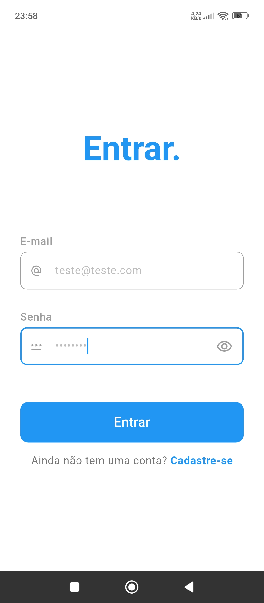

# flutter_mvvm_supabase_auth_flow

[MVVM + Riverpod + Supabase + Internacionalização] Sistema flutter de login e cadastro com persistência de sessão.

#### Observação

As decisões técnicas e desenvolvimento do código-fonte deste projeto foram realizadas pelo autor, sem modelos de IA generativa.


## Screenshots

<table align="center">
  <tr>
    <td><strong>Sign Up</strong></td>
    <td><strong>Login</strong></td>
    <td><strong>Home</strong></td>
  </tr>
  <tr>
    <td></td>
    <td></td>
    <td></td>
  </tr>
</table>

## Descrição

Fluxo completo de autenticação de usuários com **MVVM**, **Riverpod** para gerenciamento de estado e dependências, **Supabase** para persistência de dados e validações de login e **Flutter Localizations** para internacionalização (seleção dinâmica de idiomas de acordo com o sistema operacional).

### Funcionalidades:


* **Autenticação:** Criação de contas com validação de email único (um email para uma conta) e validação de acesso de usuários existentes.
* **Persistência de Sessão:** O usuário continua conectado mesmo após fechar o aplicativo.
* **Gerência de Estado:** Controle de estado das páginas (carregamento, sucesso e erro) para operações do sistema.


## Fluxo geral de dependências

O diagrama abaixo mostra a comunicação dos componentes do sistema, de cima para baixo:

```
[ View / main ]
      | Dispara ações (ex: botão pressionado, inicialização do app, etc.)
      | 
[ ViewModel (Riverpod Provider) ]
      | Solicita ação do repositório
      | Altera estado de acordo com o estágio da execução das operações
      |
[ Repository ] 
      | Requisita e orquestra operações do datasource
      | Faz validações técnicas e de negócio
      | 
[ Datasource ] 
      | Tem contato direto com o banco de dados
      | Realiza operações de persistência e carregamento
      |
(Retorno atualiza o estado e interface para o usuário)
```


## Configuração e Execução

### 1. Configuração do Supabase


#### 1.1 Variáveis de ambiente (.env)
Crie um arquivo chamado `.env` na raiz do projeto e adicione as suas credenciais do Supabase. Em caso de dúvidas, siga o exemplo disponível no arquivo `env_example`.

```
SUPABASE_URL=sua_url_aqui
SUPABASE_PUBLISHABLE_KEY=sua_chave_aqui
```

#### 1.2 Criação da tabela 'profiles'

Após criar seu projeto no supabase, acesse a aba `SQL Editor` e execute o código abaixo para criar a tabela `profiles`:

```sql
-- Create a table for public profiles
create table profiles (
  id uuid references auth.users on delete cascade not null primary key,
  email text unique,
  --updated_at timestamp with time zone,

  constraint username_length check (char_length(email) <= 350)
);
-- Set up Row Level Security (RLS)
-- See https://supabase.com/docs/guides/auth/row-level-security for more details.
alter table profiles
  enable row level security;

create policy "Public profiles are viewable by everyone." on profiles
  for select using (true);

create policy "Users can insert their own profile." on profiles
  for insert with check ((select auth.uid()) = id);

create policy "Users can update own profile." on profiles
  for update using ((select auth.uid()) = id);

-- This trigger automatically creates a profile entry when a new user signs up via Supabase Auth.
-- See https://supabase.com/docs/guides/auth/managing-user-data#using-triggers for more details.
create function public.handle_new_user()
returns trigger
set search_path = ''
as $$
begin
  insert into public.profiles (id, email) --full_name, avatar_url)
  values (
    new.id, 
    new.email
  ); --new.raw_user_meta_data->>'full_name', new.raw_user_meta_data->>'avatar_url');
  return new;
end;
$$ language plpgsql security definer;
create trigger on_auth_user_created
  after insert on auth.users
  for each row execute procedure public.handle_new_user();
```

### 2. Instalação de dependências
Execute o comando para baixar os pacotes do projeto:

```bash
flutter pub get
```

### 3. Iniciar o aplicativo

Adicione a flag `--dart-define-from-file=.env` aos argumentos adicionais de execução na sua IDE ou execute o comando abaixo:

```bash
flutter run --dart-define-from-file=.env
```